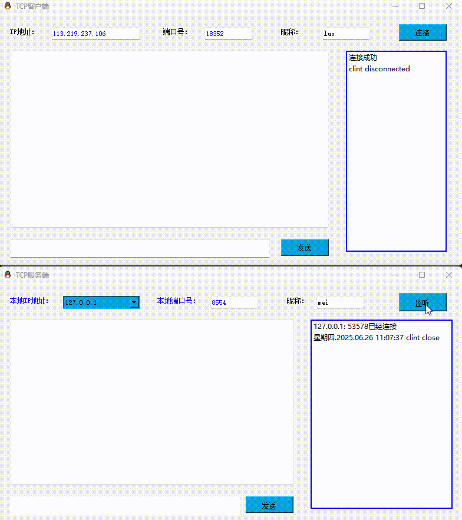

# Qt TCP 聊天室


一个基于 **Qt** 开发的 **TCP 聊天室** 程序，支持服务端与客户端模式，实现多用户实时文字聊天。

 <!-- 放置你的视频或波形演示动图 -->

---
 <!-- 放置你的视频或波形演示动图 -->


## 🌟 功能特性

- 💬 **多客户端通信**：客户端消息由服务端中转，实现广播式聊天
- 🧑‍💻 **昵称显示**：自动标注发送者昵称，增强识别性
- 🎨 **颜色区分**：
  - 自己发送的消息：蓝色显示
  - 接收到的消息：红色显示
- 🔔 **音效提示**：接收消息及连接状态变化时播放提示音
- 🌐 **IP自动检测**：服务端自动列出本机可用 IPv4 地址供选择

## 🧩 编译与运行

### ✅ 依赖环境
- Qt 5.12+ (建议使用 MinGW 64-bit 编译器)
- C++11 支持的编译器

### ▶️ 服务端运行方式
1. 选择本机 IP 和端口号
2. 点击 “监听” 按钮启动服务端

### 💻 客户端运行方式
1. 输入服务端的 IP 和端口号
2. 点击 “连接” 按钮建立连接
3. 在昵称输入框 `leport_2` 中设置昵称后即可开始聊天

## 📁 项目结构

```
tcp_chatroom/
├── client/         # 客户端代码
│   ├── widget.cpp  # 客户端界面逻辑
│   └── widget.h
├── server/         # 服务端代码
│   ├── widget.cpp  # 服务端逻辑
│   └── widget.h
├── resources/      # 资源文件
│   ├── sounds/     # 音效文件
│   └── images/     # 图标资源
└── README.md       # 项目说明文档
```

## 📡 协议格式

消息传输采用以下格式：

```
[昵称]消息内容
```

> ⚠️ 注意：昵称中包含 `]` 字符可能导致解析错误

## 🧭 已知问题

- 暂不支持昵称中含 `]` 字符
- 非 UTF-8 编码的消息可能显示乱码

## 👨‍💻 作者

[你的名字 / 团队名]

## 📄 许可证

本项目使用 **MIT License**，详见 LICENSE 文件。
